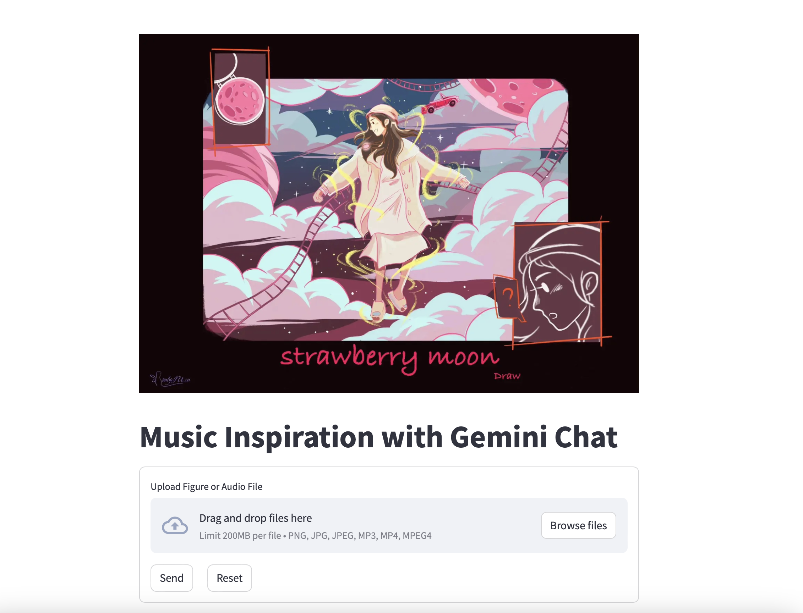

### Simple Streamlit App with Gemini-Pro

It provides idea for creating new songs.

- [x] Incorporate with Spotify API
- [x] Integrate with Google Music Generator
- [x] Use musicpy to generate a small piece of music 
- [x] Support audio and figure as inputs and display
- [x] Support markdown display and copy to clipboard

Simple demo: https://frankling2020-gemini-music-inspiration.streamlit.app